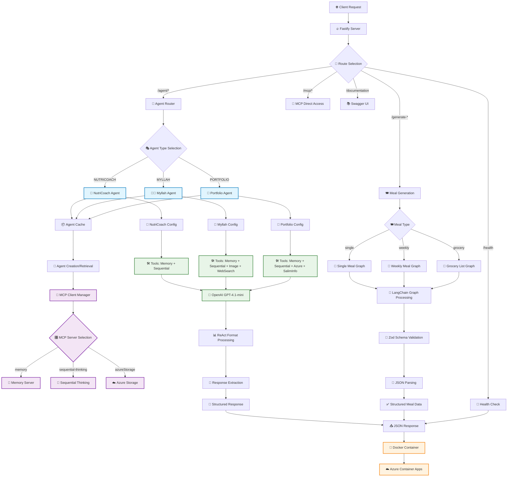

# 🚀 Architecture Flow - Service AI

## 📋 Vue d'ensemble

Voici le diagramme de flux complet de ton projet **Service AI** - un système multi-agent sophistiqué avec intégration MCP (Model Context Protocol).



## 🏗️ Architecture Détaillée

### 1. 🎯 **Points d'Entrée**
```typescript
// src/app.ts - Configuration Fastify
📍 Port: 3000 (configurable)
📍 CORS: Activé pour tous les domaines
📍 Swagger: Documentation auto-générée
📍 Graceful Shutdown: Gestion SIGINT/SIGTERM
```

### 2. 🤖 **Système Multi-Agent**

#### **Agent Types & Capabilities**
```typescript
enum AgentType {
  NUTRICOACH = 'nutricoach',  // 🥗 Nutrition & Fitness
  MYLLAH = 'myllah',          // 👩‍🍳 Recettes & Blog
  PORTFOLIO = 'portfolio'      // 💼 Portfolio Professionnel
}
```

#### **Agent Configuration Matrix**
| Agent | MCP Servers | Extra Tools | Spécialisation |
|-------|-------------|-------------|----------------|
| 🥗 **NutriCoach** | `memory` + `sequential-thinking` | Aucun | Nutrition & Fitness |
| 👩‍🍳 **Myllah** | `memory` + `sequential-thinking` | `ImageGen` + `WebSearch` | Recettes & Blog |
| 💼 **Portfolio** | `memory` + `sequential-thinking` + `azureStorage` | `SalimInfoRetriever` | Lead Generation |

### 3. 🔧 **MCP (Model Context Protocol)**

#### **Serveurs MCP Disponibles**
```typescript
🗄️ Memory Server        → Persistance conversations
🧠 Sequential Thinking  → Raisonnement avancé
☁️ Azure Storage        → Stockage fichiers & leads
```

#### **Architecture MCP**
```typescript
// Singleton Pattern pour performance
globalMcpClient → MultiServerMCPClient
    ├── memory: npx @modelcontextprotocol/server-memory
    ├── sequential-thinking: npx @modelcontextprotocol/server-sequential-thinking
    └── azureStorage: npx @ignitionai/azure-storage-mcp
```

### 4. 🍽️ **Système de Génération de Repas**

#### **LangChain Graphs**
```typescript
📊 generateSingleMeal.ts    → Repas personnalisé
📅 generateWeeklyMeals.ts   → Plan hebdomadaire
🛒 generateGroceryList.ts   → Liste de courses
```

#### **Pipeline de Traitement**
```
Input → LangChain Graph → Zod Validation → JSON Parsing → Structured Output
```

### 5. 🔄 **Format de Réponse ReAct**

Tous les agents utilisent le format structuré:
```
Question: [input question]
Thought: [reasoning process]
Action: [tool to use]
Action Input: [tool parameters]
Observation: [tool results]
...
Thought: I now know the final answer
Final Answer: [markdown formatted response]
```

### 6. 🛠️ **Stack Technique**

#### **Core Technologies**
- **Runtime**: Node.js 22+ + TypeScript
- **Framework**: Fastify + CORS
- **AI/ML**: LangChain + OpenAI GPT-4.1-mini
- **Package Manager**: pnpm
- **Containerization**: Docker multi-stage

#### **Intégrations AI**
- **LangChain**: Orchestration des agents
- **OpenAI**: Modèles GPT-4.1-mini
- **DALL-E**: Génération d'images
- **DuckDuckGo**: Recherche web

### 7. 🚀 **Déploiement**

#### **Infrastructure**
```
Local Dev → Docker Build → Azure Container Registry → Azure Container Apps
```

#### **Environment Variables**
```bash
OPENAI_API_KEY=sk-...
PORT=3000
HOST=0.0.0.0
LANGSMITH_TRACING=true
```

## 🔄 **Flux de Traitement Type**

### **Exemple: Interaction Agent Portfolio**
```
1. Client POST /agent/start-chat
2. Route vers Agent Router
3. Sélection Portfolio Agent
4. Chargement depuis cache ou création
5. Initialisation MCP (memory + sequential + azure)
6. Traitement ReAct avec GPT-4.1-mini
7. Exécution tools (SalimInfoRetriever)
8. Response formatting
9. Storage Azure (si lead)
10. JSON Response au client
```

### **Exemple: Génération de Repas**
```
1. Client POST /generate-weekly
2. Route vers Weekly Meal Graph
3. LangChain Graph Processing
4. GPT-4.1-mini generation
5. Zod schema validation
6. JSON parsing & structuring
7. Nutritional analysis
8. Structured meal data response
```

## 💡 **Points Clés d'Innovation**

1. **🔄 Agent Caching**: Performance optimisée avec mise en cache
2. **🔗 MCP Integration**: Extensibilité via serveurs MCP
3. **🎯 Multi-Agent**: Spécialisation par domaine
4. **📊 Structured Data**: Validation Zod + parsing robuste
5. **🚀 Scalable**: Architecture prête pour production

## 🎯 **Avantages Techniques**

- **Performance**: Cache multi-niveau (agents + MCP)
- **Extensibilité**: Ajout facile de nouveaux agents/outils
- **Robustesse**: Gestion d'erreurs complète
- **Observabilité**: LangSmith tracing
- **Production-Ready**: Docker + Azure déployé

---

*Cette architecture démontre un système AI sophistiqué, production-ready, avec une séparation claire des responsabilités et une scalabilité optimale.*
